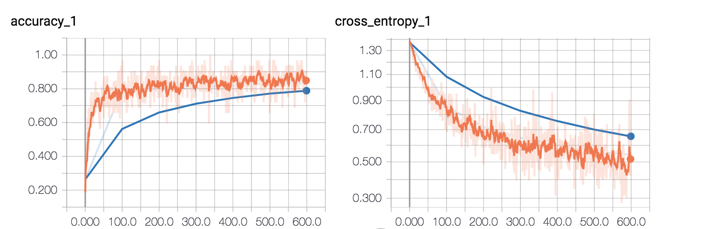

## Retraining 2
Lowered the training rate, added image distortions.

Parameters:
```
architecture='mobilenet_1.0_224', 
bottleneck_dir='/tmp/bottleneck', 
eval_step_interval=100,
final_tensor_name='final_result', 
flip_left_right=True, 
how_many_training_steps=600,
image_dir='data/', 
intermediate_output_graphs_dir='/tmp/intermediate_graph/', 
intermediate_store_frequency=0,
learning_rate=0.0001, model_dir='/tmp/imagenet', 
output_graph='/tmp/output_graph.pb',
output_labels='/tmp/output_labels.txt', 
print_misclassified_test_images=False, 
random_brightness=30,
random_crop=0, 
random_scale=30, 
saved_model_dir='/tmp/saved_models/1/',
summaries_dir='/tmp/retrain_logs', 
test_batch_size=-1, 
testing_percentage=10, 
train_batch_size=32,
validation_batch_size=-1, 
validation_percentage=10
```

Conclusions: 
1. Training time improved greatly (from 5 minutes to 1 hour) - with distortions can't take advantage of bottleneck caching
2. Model no longer overfits, but it converges more slowly
3. Should try with higher training rate
4. Should train for longer




