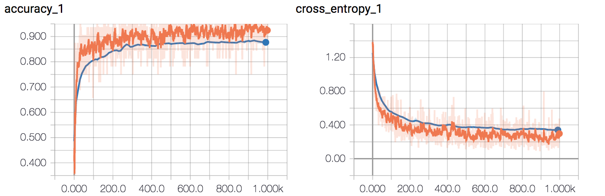

## Retraining 3
Raised the training rate from 0.0001 to 0.001, increased training to 1000 epochs.

Parameters:
```
architecture='mobilenet_1.0_224', 
bottleneck_dir='/tmp/bottleneck', 
eval_step_interval=100,
final_tensor_name='final_result', 
flip_left_right=True, 
how_many_training_steps=1000,
image_dir='data/', 
intermediate_output_graphs_dir='/tmp/intermediate_graph/', 
intermediate_store_frequency=0,
learning_rate=0.001, model_dir='/tmp/imagenet', 
output_graph='/tmp/output_graph.pb',
output_labels='/tmp/output_labels.txt', 
print_misclassified_test_images=False, 
random_brightness=30,
random_crop=0, 
random_scale=30, 
saved_model_dir='/tmp/saved_models/1/',
summaries_dir='/tmp/retrain_logs', 
test_batch_size=-1, 
testing_percentage=10, 
train_batch_size=32,
validation_batch_size=-1, 
validation_percentage=10
```

Conclusions: 
1. Train accuracy is 94%
2. Validation accuracy is 89%
3. 1000 epochs of training took 1 hour on laptop cpu inside a docker container
4. Could train for longer, the model doesn't overfit the data




